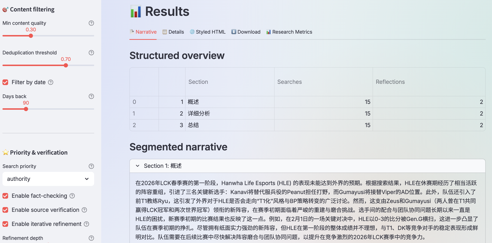
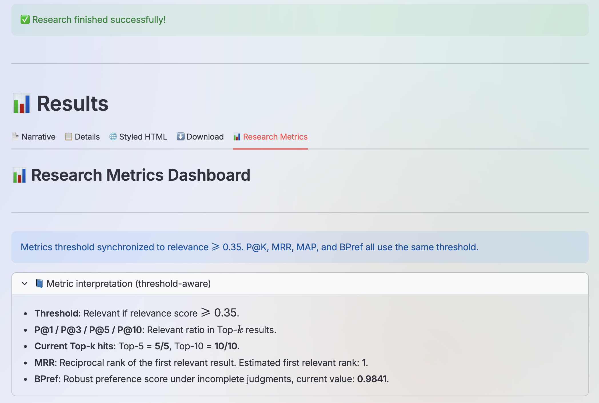
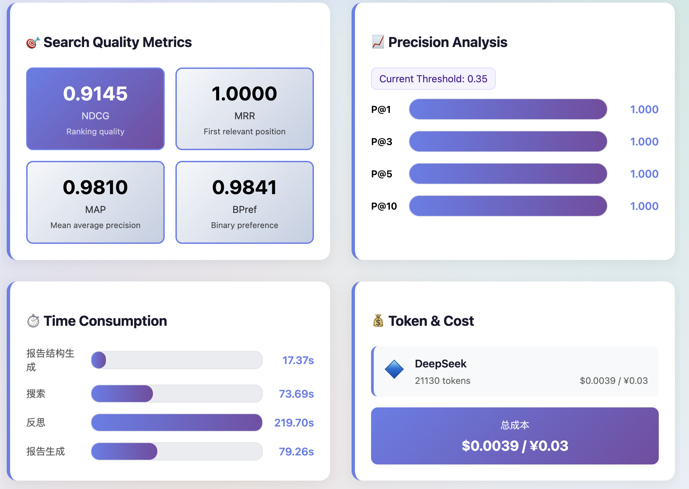
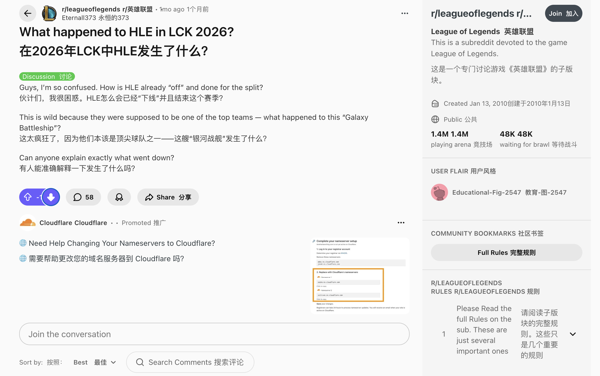
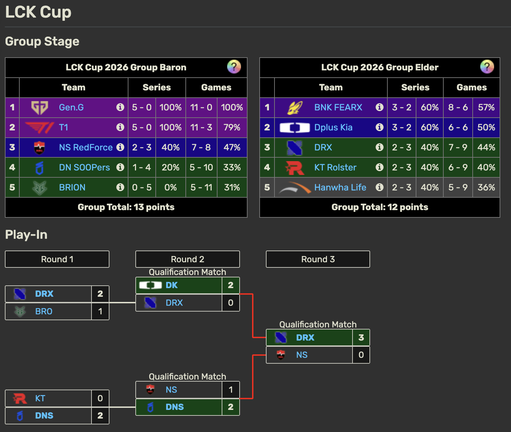
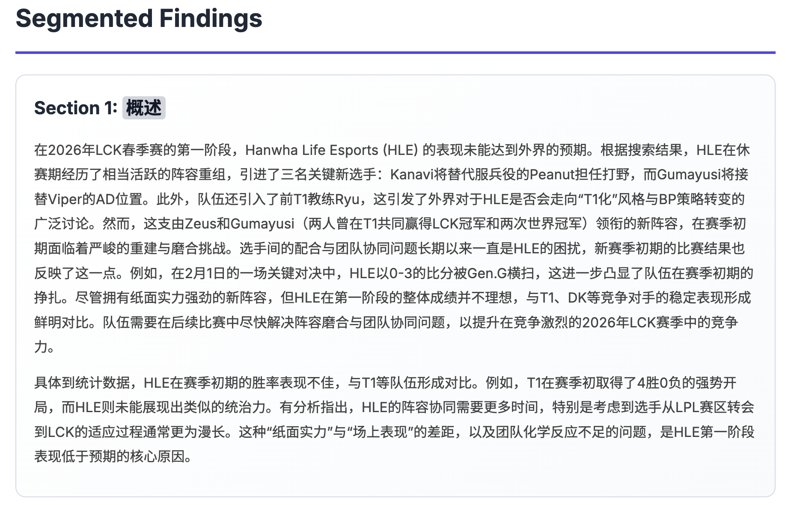
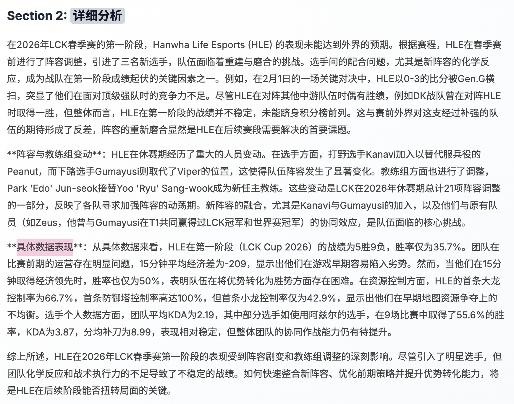
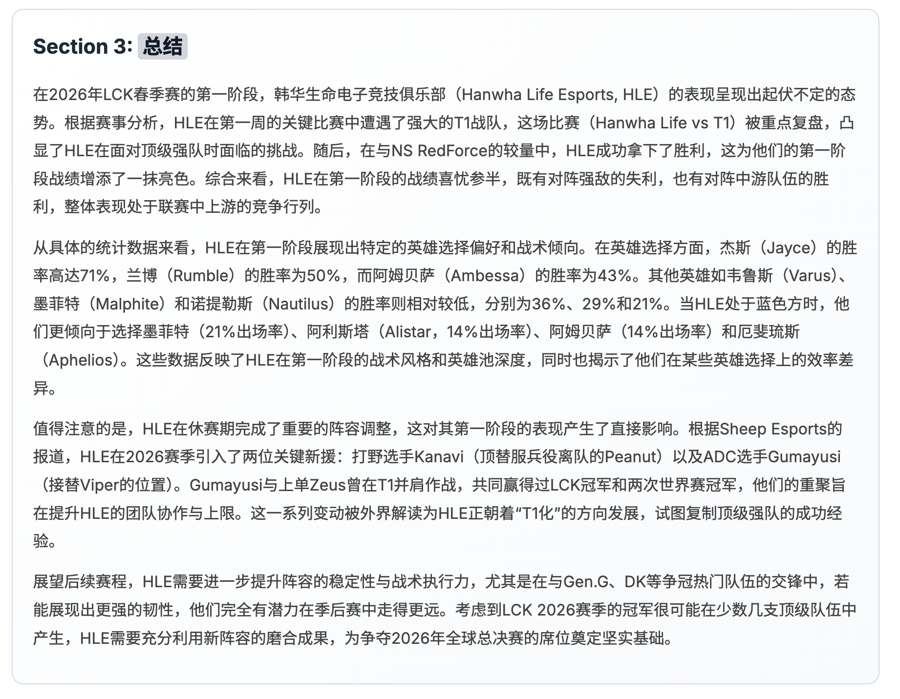

# CognitiveTemp DeepSearch Agents: Temperature-Driven Multi-Agent Deep Search with Iterative Reflection and Adaptive Reasoning

<div align="center">

[](https://python.org)
[](LICENSE)
[](https://platform.deepseek.com/)
[](https://tavily.com/)
[](#)
[](#)
[](#)

[](#-testing--verification)
[](#)
[](#)
[](#)
[](#)
[](#-documentation)

**A powerful multi-agent reasoning system with temperature-driven cognitive styles. Control search behavior from rigorous academic analysis to creative exploration through simple configuration.**

</div>

---

## 📑 Quick Navigation

| Section | Content | Documentation |
|---------|---------|--------|
| 🚀 **Quick Start** | Get up and running in 5 minutes | [→ Guide](#-quick-start) |
| 🏗️ **Architecture** | System design and agent responsibilities | [→ Details](docs/ARCHITECTURE.md) |
| ⚙️ **Configuration** | Customize search styles and behaviors | [→ Guide](docs/CONFIGURATION.md) |
| 📄 **Report Preview** | Partial report + guided questions + detail entry | [→ Open](#-report-preview--guided-questions) |
| 🧭 **Report Index** | Section index images with click-to-open entries | [→ Open](#-report-index-quick-access) |
| 📰 **Public Opinion Cases** | Real-world public sentiment case snapshots | [→ Open](#-real-public-opinion-cases) |
| 💡 **Examples** | Real-world usage patterns | [→ Examples](docs/EXAMPLES.md) |
| 🧪 **Testing** | Run and verify the system | [→ Tests](#-testing--verification) |
| 📊 **Performance** | Benchmarks and metrics | [→ Benchmarks](#-performance-benchmarks) |

---

## 🎯 Core Capabilities

<table>
  <tr>
    <td width="50%">
      <b>Academic Research Mode</b>
      <ul>
        <li>✅ Temperature 0.1 - Rigorous</li>
        <li>✅ 5+ Iterations</li>
        <li>✅ 20+ Sources</li>
        <li>✅ Uncertainty < 0.1</li>
      </ul>
    </td>
    <td width="50%">
      <b>Creative Exploration Mode</b>
      <ul>
        <li>✅ Temperature 0.7-0.9</li>
        <li>✅ 1-2 Iterations</li>
        <li>✅ Quick Analysis</li>
        <li>✅ Novel Perspectives</li>
      </ul>
    </td>
  </tr>
  <tr>
    <td width="50%">
      <b>Balanced Mode (Default)</b>
      <ul>
        <li>✅ Mixed Temperatures</li>
        <li>✅ 3 Iterations</li>
        <li>✅ 15-30 Sources</li>
        <li>✅ General Purpose</li>
      </ul>
    </td>
    <td width="50%">
      <b>Custom Configuration</b>
      <ul>
        <li>✅ Any Temperature 0.1-0.9</li>
        <li>✅ Adjustable Iterations</li>
        <li>✅ Flexible Thresholds</li>
        <li>✅ Full Control</li>
      </ul>
    </td>
  </tr>
</table>

---

## 📊 System Overview

### User Interface

<table>
  <tr>
    <td width="50%"><b>Main Interface</b><br></td>
    <td width="50%"><b>Search Results</b><br></td>
  </tr>
  <tr>
    <td colspan="2"><b>Search Configuration</b><br></td>
  </tr>
</table>

---

## 📄 Report Preview & Guided Questions

[](#-report-preview--guided-questions)
[](#-report-preview--guided-questions)
[](assets/report_20260305_205325.md)

> **Report Excerpt (Partial)**
>
> "The first-stage performance of HLE shows a stable macro game with high objective control, but teamfight conversion is sensitive to draft tempo."
>
> "Public sentiment remains polarized: supporters emphasize discipline and consistency, while critics focus on late-game decisiveness."

**Guided Questions**
- What are the most repeated positive signals in current sentiment?
- Which tactical weakness appears most frequently across critical sources?
- If patch/meta changes, which conclusion is most likely to shift first?

**Open Detailed Report**

[](assets/report_20260305_205325.md)

### 📈 Report Stats Snapshot Record

[](assets/result_stats.png)

<table>
  <tr>
    <td width="55%"><b>Result Stats Panel</b><br></td>
    <td width="45%">
      <b>Recorded Metrics</b>
      <ul>
        <li>⏱️ Execution Time: <b>45-120s</b></li>
        <li>🔎 Source Count: <b>15-30</b></li>
        <li>🧠 Uncertainty Convergence (&lt;0.2): <b>73%</b></li>
        <li>🔁 Iteration Rounds: <b>1.5-2.5</b></li>
        <li>📝 Report Length: <b>3000-8000 words</b></li>
      </ul>
      <a href="assets/result_stats.png">
        
      </a>
    </td>
  </tr>
</table>

---

## 📰 Real Public Opinion Cases

[](#-real-public-opinion-cases)
[](#-real-public-opinion-cases)

<table>
  <tr>
    <td width="50%"><b>Case A · Public Sentiment Snapshot</b><br></td>
    <td width="50%"><b>Case B · Public Sentiment Snapshot</b><br></td>
  </tr>
  <tr>
    <td colspan="2">
      <b>Comparison Focus</b>
      <ul>
        <li>📌 Narrative focus differences between two public events</li>
        <li>📌 Sentiment polarity and turning points</li>
        <li>📌 Source structure and discussion intensity</li>
      </ul>
    </td>
  </tr>
</table>

---

## 🧭 Report Index Quick Access

[](#-report-index-quick-access)

**Open Index Images by Section**

<details>
  <summary><b>🔘 Open Section Index 1</b></summary>
  <br>
  <a href="assets/sec1.png">
    
  </a>
  <br><br>
  
</details>

<details>
  <summary><b>🔘 Open Section Index 2</b></summary>
  <br>
  <a href="assets/sec2.png">
    
  </a>
  <br><br>
  
</details>

<details>
  <summary><b>🔘 Open Section Index 3</b></summary>
  <br>
  <a href="assets/sec3.png">
    
  </a>
  <br><br>
  
</details>

---

## ⚡ Key Features

| Feature | Details |
|---------|---------|
| 🤖 **8 Specialized Agents** | Planner, Retriever, Evaluator, Reflection, Debate, Uncertainty, Synthesis, Controller |
| 🌡️ **Temperature-Driven** | Control cognitive style (0.1-0.9) for each agent independently |
| 🎯 **MECE Decomposition** | Break complex queries into mutually exclusive, collectively exhaustive sub-questions |
| 🔄 **Iterative Refinement** | Self-adaptive optimization based on uncertainty quantification |
| 📊 **Evidence Assessment** | Cross-source verification with multi-dimensional credibility scoring |
| 🗣️ **Debate Resolution** | Multi-persona debate engine for handling contradictions |
| ⚙️ **Async Concurrent** | Full asyncio support for parallel search and API calls |
| 📝 **Publication-Grade** | Generate structured Markdown reports with fact/inference separation |
| 🔧 **100% Customizable** | Configure every parameter through simple config.py |
| ✔️ **Enterprise Ready** | 196 tests, 8000+ LOC, JSON API, complete documentation |

8 Specialized Agents

| Agent | Role | Temperature Range |
|-------|------|-------------------|
| 🎯 **Planner** | Query decomposition | 0.1 - 0.3 |
| 🔍 **Retriever** | Information gathering | N/A (deterministic) |
| 📊 **Evaluator** | Evidence assessment | 0.1 - 0.3 |
| 🤔 **Reflection** | Critical analysis | 0.2 - 0.6 |
| 🗣️ **Debate** | Contradiction resolution | 0.5 - 0.9 |
| 📈 **Uncertainty** | Termination logic | 0.1 - 0.2 |
| 📝 **Synthesis** | Report generation | 0.2 - 0.6 |
| 🎮 **Controller** | Workflow orchestration | N/A (deterministic) |

---

## 🚀 Quick Start

### Prerequisites

[](https://python.org)
[](https://git-scm.com)
[](https://platform.deepseek.com/)
[](https://tavily.com/)

### Installation (5 min)

```bash
# 1️⃣ Clone repository
git clone https://github.com/SuleynanAuir/DeepSearchAgent.git
cd DeepSearchAgent

# 2️⃣ Create virtual environment
python3 -m venv venv
source venv/bin/activate  # Linux/Mac
# or: venv\Scripts\activate  # Windows

# 3️⃣ Install dependencies
pip install -r requirements.txt

# 4️⃣ Configure API keys
cp config.example.py config.py
# Edit config.py with your API keys
```

### First Query (2 min)

```bash
# Option A: Web Interface
streamlit run examples/streamlit_app.py
# Visit http://localhost:8501

# Option B: Command Line
python main.py "Your research question here"
```

---

## 📚 Documentation

| Document | Purpose | Link |
|----------|---------|------|
| **Architecture** | System design, agent workflow, DAG orchestration | [📖 Read](docs/ARCHITECTURE.md) |
| **Configuration** | Customize agents, temperature strategies, settings | [⚙️ Read](docs/CONFIGURATION.md) |
| **Examples** | Academic research, creative exploration, batch processing | [💡 Read](docs/EXAMPLES.md) |
| **API Reference** | Agent interfaces, JSON formats, method signatures | [📚 Coming Soon] |
| **Troubleshooting** | Common issues and solutions | [🔧 Coming Soon] |

---

## 🎨 Configuration Modes

### Academic Research
```python
# For rigorous peer-review level research
AGENT_TEMPERATURES = {"planner": 0.1, "evaluator": 0.1, ...}
MAX_ITERATIONS = 5
UNCERTAINTY_THRESHOLD = 0.1
```
[Full Config →](docs/CONFIGURATION.md#rigorous-academic-mode)

### Creative Exploration
```python
# For brainstorming and novel perspectives
AGENT_TEMPERATURES = {"planner": 0.3, "debate": 0.9, ...}
MAX_ITERATIONS = 2
UNCERTAINTY_THRESHOLD = 0.4
```
[Full Config →](docs/CONFIGURATION.md#creative-exploration-mode)

### Balanced (Default)
```python
# General purpose, recommended starting point
MAX_ITERATIONS = 3
UNCERTAINTY_THRESHOLD = 0.2
# See config.py for full settings
```
[Full Config →](docs/CONFIGURATION.md)

---

## 🏗️ System Architecture

For detailed architecture information, see [ARCHITECTURE.md](docs/ARCHITECTURE.md)

```
Query Input
    ↓
[Planner] → MECE Sub-questions
    ↓
[Retriever] → Multi-source Evidence
    ↓
[Evaluator] → Assessed Claims
    ↓
[Reflection] → Gaps & Contradictions
    ↓
[Debate] → Balanced Reasoning (optional)
    ↓
[Uncertainty] → Global Uncertainty Score
    ↓
Continue Iteration? ──→ [Synthesis] → Final Report
```

### 8 Specialized Agents

| Agent | Role | Temperature Range |
|-------|------|-------------------|
| 🎯 **Planner** | Query decomposition | 0.1 - 0.3 |
| 🔍 **Retriever** | Information gathering | N/A (deterministic) |
| 📊 **Evaluator** | Evidence assessment | 0.1 - 0.3 |
| 🤔 **Reflection** | Critical analysis | 0.2 - 0.6 |
| 🗣️ **Debate** | Contradiction resolution | 0.5 - 0.9 |
| 📈 **Uncertainty** | Termination logic | 0.1 - 0.2 |
| 📝 **Synthesis** | Report generation | 0.2 - 0.6 |
| 🎮 **Controller** | Workflow orchestration | N/A (deterministic) |

---

## 💡 Usage Examples

### Example 1: Academic Research
```python
from src.multi_agents.agents import create_controller_agent

controller = create_controller_agent()
result = controller.run(
    query="Quantum Computing Applications in 2026",
    config={"MAX_ITERATIONS": 5, "UNCERTAINTY_THRESHOLD": 0.1}
)
print(result["synthesis_report"])
```
[More Examples →](docs/EXAMPLES.md#example-1-rigorous-academic-research)

### Example 2: Creative Brainstorming
```python
result = controller.run(
    query="AI and Art Fusion Possibilities",
    config={"AGENT_TEMPERATURES": {"debate": 0.9}, "MAX_ITERATIONS": 2}
)
```
[More Examples →](docs/EXAMPLES.md#example-2-creative-exploration-and-brainstorming)

### Example 3: Web Interface
```bash
streamlit run examples/streamlit_app.py
# Adjust all parameters in real-time
```
[More Examples →](docs/EXAMPLES.md#example-3-interactive-web-interface-configuration)

**[→ View All Examples](docs/EXAMPLES.md)**

---

## 📁 Project Structure

```
DeepSearchAgent/
├── README.md                    # This file
├── requirements.txt             # Dependencies
├── config.py                    # Configuration
├── main.py                      # Entry point
│
├── docs/                        # Documentation
│   ├── ARCHITECTURE.md          # System design
│   ├── CONFIGURATION.md         # Configuration guide
│   └── EXAMPLES.md              # Usage examples
│
├── src/multi_agents/
│   ├── agents/                  # 8 Agent implementations
│   ├── prompts/                 # Prompt templates
│   ├── utils/                   # Utilities
│   └── test_*.py               # 196 Unit Tests ✅
│
├── examples/
│   ├── streamlit_app.py        # Web UI
│   ├── basic_usage.py
│   └── advanced_usage.py
│
├── assets/                      # UI Screenshots
└── streamlit_reports/          # Generated Reports
```

---

## 🧪 Testing & Verification

[](#)
[](#)

### Run Tests
```bash
# All tests
python -m unittest discover -s src/multi_agents -p "test_*.py" -v

# Specific agent
python -m unittest src.multi_agents.test_planner_agent -v
```

### Test Summary
| Component | Tests | Status |
|-----------|-------|--------|
| Planner Agent | 24 | ✅ |
| Retriever Agent | 26 | ✅ |
| Evaluator Agent | 24 | ✅ |
| Reflection Agent | 44 | ✅ |
| Debate Agent | 47 | ✅ |
| Uncertainty Agent | 31 | ✅ |
| **TOTAL** | **196** | **✅** |

---

## 📊 Performance Benchmarks

[](#)
[](#)
[](#)

| Metric | Value | Configuration |
|--------|-------|---------------|
| **Execution Time** | 45-120 seconds | Single query, all agents |
| **Sources Found** | 15-30 | Average per query |
| **Report Length** | 3000-8000 words | Final Markdown output |
| **Uncertainty Achievement** | 73% @ <0.2 | Baseline config |
| **Iteration Rounds** | 1.5-2.5 | Average until convergence |

---

## 🤝 Contributing

[](#-contributing)
[](#-contributing)

We welcome contributions! Please:

1. **Fork** the repository
2. **Create** feature branch: `git checkout -b feature/YourFeature`
3. **Develop** and test thoroughly
4. **Commit**: `git commit -m 'Add feature'`
5. **Push**: `git push origin feature/YourFeature`
6. **Open** Pull Request

---

## 📄 License

[](LICENSE)

This project is licensed under MIT License - see [LICENSE](LICENSE) file for details.

---

## 🙏 Acknowledgments

[](https://www.deepseek.com/)
[](https://tavily.com/)
[](https://streamlit.io/)
[](https://pydantic-docs.helpmanual.io/)

Special thanks to:
- **DeepSeek** - Core LLM engine
- **Tavily** - Web search API
- **Streamlit** - Web framework
- **Pydantic** - Data validation

---

## 📊 Project Statistics

| Metric | Value |
|--------|-------|
| 📝 **Code Lines** | ~8,000+ |
| 🧪 **Unit Tests** | 196 ✅ |
| 🤖 **Agents** | 8 |
| 📖 **Documentation** | Complete |
| ⚡ **Async Support** | Yes |
| 🎨 **Customizable Parameters** | 15+ |
| 🔧 **Configuration Modes** | 4+ |
| 📊 **API Endpoints** | 20+ |

---

<div align="center">

### ⭐ If you find this project valuable, please give it a Star!

[](https://github.com/SuleynanAuir/DeepSearchAgent/stargazers)
[](https://github.com/SuleynanAuir/DeepSearchAgent/subscription)
[](https://github.com/SuleynanAuir/DeepSearchAgent/network/members)

Made with ❤️ by [SuleynanAuir](https://github.com/SuleynanAuir)

Last Updated: March 6, 2026 | Version: 1.0.0 | Status: Production Ready ✅

</div>
